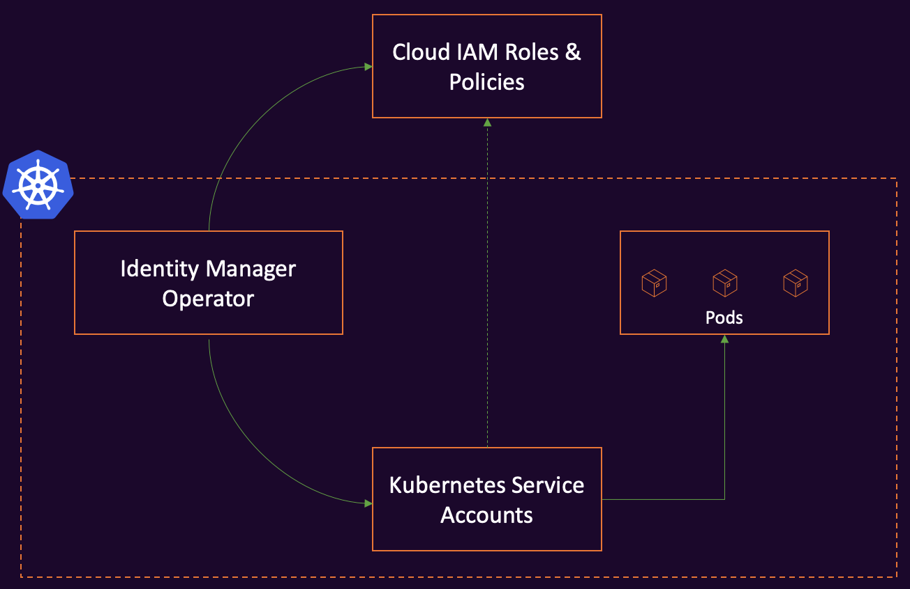

# Overview

## Architecture

The Identity Manager Operator extends Kubernetes with Custom Resources to provide necessary Service Accounts along with required IAM Roles & Policies for pods to connect with Cloud APIs. The controller creates the defined policies in the cloud and maps them to the defined service account. If the desired state is changed, the controller will reconcile the state in the cluster and in the cloud. The supported cloud platforms are AWS and Azure.

## WorkloadIdentity

The WorkloadIdentity resource defines the cloud provider, and the cloud provider's spec. The cloud provider defines the cloud platform for which the policies have to be created. Currently supported cloud providers are AWS and Azure. The Role policies define the policies that the pods require to access to appropriate cloud APIs. The service account defines the service account which is mapped to the defined policies. The WorkloadIdentity resource is namespaced.

## Behavior

The Identity Manager Operator reconciles the WorkloadIdentity in the following manner:

1. The Identity Manager identifies the cloud provider using `spec.provider`.
2. The Identity Manager uses specified credentials in `spec.credentials` to instanciate the cloud provider's API client to make subsequent API calls.
3. The Identity Manager creates the role policies and inline policies defined in cloud provider's spec.
4. The Identity Manager creates or updates the service account depending on the service account action specified in the WorkloadIdentity.
5. The Identity Manager ensures that the policies stay in sync with defined desired state.

## Access Control

The Identity Manager Operator runs as a deployment in your cluster with elevated
privileges. It will read secrets in all namespaces. Ensure that the credentials you provide give Identity Manager the least privilege necessary.